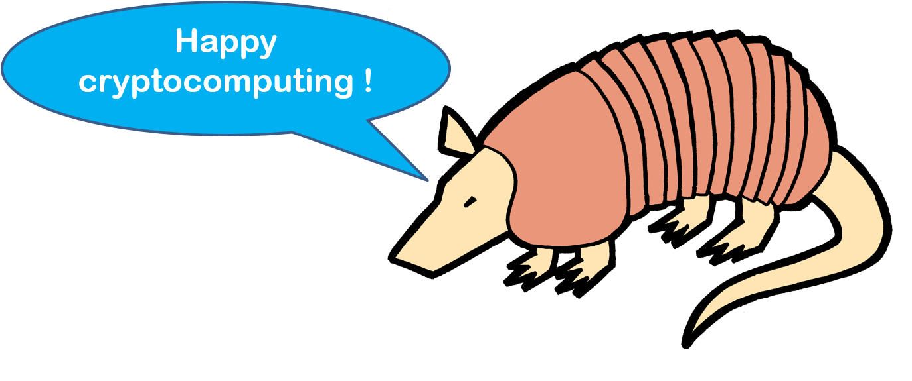

# Cingulata

Cingulata (pronounced "tchingulata") is a compiler toolchain and RTE for running C++ programs over encrypted data by means of fully homomorphic encryption techniques.

The toolchain is formerly known as the Armadillo toolchain.

For details, installation guide and tutorials, please check out the [project's Wiki](https://github.com/CEA-LIST/Cingulata/wiki).

Enjoy,



# Quickstart

You can use Docker to easily build and run Cingulata. Run:

```
docker build .
```

To build the container which will contain the Cingulata compiler and

```
docker run [container_id]
```

to generate the Hello World with Cingulata.